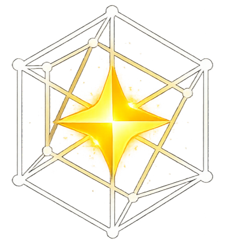

<div align="center">
  

  # KairoLab Website

  *Website institucional do estúdio de pesquisa e desenvolvimento de software **KairoLab**.*
</div>

<p align="center">
  
  
  
</p>

---

## 🚀 Visão Geral

O projeto foi construído para apresentar o portfólio de projetos da KairoLab, os membros ativos do ecossistema e a stack principal de cada iniciativa. 

Desenvolvido com **Next.js 16** (App Router), **TypeScript** e **Tailwind CSS 4**, o site possui uma interface moderna, responsiva e de fácil manutenção.

### ✨ O que você encontra aqui:

- **Catálogo de Projetos:** Descrição, stack tecnológica e membros associados a iniciativas como Fynco, Animes Cegal, LESS e VavaHelper.
- **Ecossistema de Membros:** Perfis da equipe com avatares dinâmicos via GitHub, especialidades e projetos relacionados.
- **Manutenção Simplificada:** Dados da aplicação totalmente centralizados em `lib/data.ts`.
- **Assets Locais:** Logos reais dos projetos organizadas de forma limpa na pasta `public/`.

## 💻 Tecnologias Utilizadas

A stack principal escolhida para o desenvolvimento garante performance e escalabilidade:

- **[Next.js 16](https://nextjs.org/)** (App Router)
- **[React 19](https://react.dev/)**
- **[TypeScript](https://www.typescriptlang.org/)**
- **[Tailwind CSS 4](https://tailwindcss.com/)**
- **[shadcn/ui](https://ui.shadcn.com/)** para componentes de interface
- **[Lucide React](https://lucide.dev/)** para iconografia
- **pnpm** como gerenciador de pacotes

## 📂 Estrutura de Diretórios

```text
├── app/
│   ├── page.tsx             # Home
│   ├── projects/page.tsx    # Listagem de Projetos
│   └── team/page.tsx        # Listagem de Membros
├── components/              # Componentes UI (shadcn e customizados)
├── lib/
│   └── data.ts              # ⚙️ Dados centralizados (Membros e Projetos)
└── public/                  # 🖼️ Assets estáticos e logos
    ├── cegal.png
    ├── fynco.png
    ├── kairo.png
    ├── less.png
    └── vavahelper.png
```

## ⚙️ Como rodar localmente

Certifique-se de ter o [pnpm](https://pnpm.io/) instalado em sua máquina.

1. Instale as dependências:
```bash
pnpm install
```

2. Inicie o servidor de desenvolvimento:
```bash
pnpm dev
```

3. Acesse o projeto no seu navegador:
```bash
http://localhost:3000
```

### 🛠️ Scripts Úteis

- `pnpm dev`: Inicia o ambiente de desenvolvimento.
- `pnpm build`: Gera a build de produção.
- `pnpm start`: Inicia a aplicação a partir da build gerada.
- `pnpm lint`: Executa a verificação de erros no código (ESLint).

## 📝 Como gerenciar o conteúdo (Membros e Projetos)

Para adicionar, editar ou remover membros e projetos, você não precisa alterar os componentes visuais. Toda a configuração principal está centralizada no arquivo:

```text
lib/data.ts
```

**Neste arquivo, você pode alterar:**
- Novos membros (incluindo usernames do GitHub e links sociais).
- Novos projetos e suas respectivas stacks.
- A relação entre os membros e os projetos em que atuam.

> **Dica de Commit:** Após realizar alterações nos dados do estúdio, utilize o padrão sugerido:
> ```bash
> git add lib/data.ts
> git commit -m "feat: update projects and team data"
> ```
